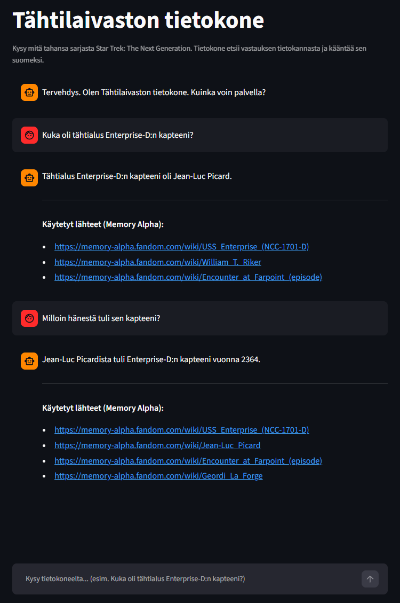

# Vektoritietokannan ja monikielisen RAG (Retrieval-Augmented Generation) -putken rakentaminen



Tämä on 4 opintopisteen (n. 108 tuntia) laajuinen korkeakouluprojekti. Projektin tavoitteena oli rakentaa vektoritietokanta, johon ladataan Wikipedia-tyyppisiä artikkeleita lyhyempinä palasina ja upotuksina, ja toteutetaan monikielinen RAG (Retrieval-Augmented Generation) -pohjainen chatbot, joka hakee vastaukset tietokannasta.

Projektin materiaalina käytettiin tv-sarjaa Star Trek: The Next Generation. Materiaali ladattiin Star Trek -universumille omistetulta Memory Alpha -sivustolta. Aiheen rajaamisen myötä hallusinoinnin testaus oli helpompaa.

Projektia testattiin ensin täysin lokaalisti omalla tietokoneella käyttäen ChromaDB-tietokantaa, Hugging Face -upotusmallia ja Llama 3 -kielimallia. Myöhemmin vaihdettiin OpenAI:n maksulliseen kielimalliin ja otettiin käyttöön Pinecone-tietokanta (ilmainen versio). Tavoitteena oli saada kokemusta lokaalin kehityksen lisäksi myös tuotantotason pilviratkaisuista.

Tämä projektikurssi suoritettiin suomeksi, joten myös dokumentointi on tehty suomeksi.

## Ominaisuudet

* **Lokaali ja pilvipohjainen versio:** Llama 3 ja ChromaDB pyörivät täysin paikallisesti, OpenAI `gpt-4o-mini` ja Pinecone pilvipohjaisena.
* **Monikielinen RAG:** Tietokannan lähdeaineisto (Memory Alpha) on englanniksi, mutta käyttö on optimoitu suomeksi. Käyttäjä voi kysyä kysymyksiä ja tekoäly vastaa sujuvalla suomen kielellä hyödyntäen monikielisiä malleja.
* **Lyhyet ja ytimekkäät vastaukset:** Chatbot ("Tähtilaivaston tietokone") vastaa kysymyksiin konemaisesti ja ytimekkäästi.
* **Kontekstitietoinen muisti:** Tekoäly ymmärtää keskustelun historian. Käyttäjä voi kysyä jatkokysymyksiä (esim. *"Kuka hän oli?"*), ja järjestelmä osaa yhdistää sen aiempaan kontekstiin.
* **Lähteiden listaus ja hallusinoinnin minimointi:** Vastauksen jälkeen chatbot kertoo, mistä tieto on löytynyt. Se ei keksi omia faktoja tai linkkejä. Jos tietoa ei löydy, se vastaa: "Tietoa ei löydy tietokannasta."
* **Cross-Encoder Re-ranker:** Hakee ensin isolla haravalla (esim. k=20) potentiaaliset osumat, jonka jälkeen tulokset järjestetään uudelleen semanttisen merkityksen perusteella ja kielimallille lähetetään niistä 4 absoluuttisesti parasta.
* **Datan esikäsittely (Firecrawl ja regex):** Fandom-wikien raskas HTML-koodi on siivottu LLM-optimoituun Markdown-muotoon. Raakadata on käsitelty regex-lausekkeilla ja siitä on poistettu muotoilut, linkit ja sisällysluettelot.

## Käytetyt teknologiat

* **Datan keräys (ingestion):** Firecrawl API
* **Upotukset (embeddings):** Hugging Face (`paraphrase-multilingual-MiniLM-L12-v2`)
* **Orkestrointi:** LangChain
* **Vektoritietokanta:** ChromaDB (lokaali) tai Pinecone (pilvi)
* **Kielimalli (LLM):** Ollama `Llama 3` (lokaali) tai OpenAI `gpt-4o-mini` (pilvi)
* **Re-Ranker (Cross-Encoder):** BAAI (`bge-reranker-v2-m3`)
* **Käyttöliittymä (frontend):** Streamlit

## Asennusohjeet

Jos projekti ajetaan täysin lokaalisti omalla tietokoneella, suosituksena on n. 8-16 GB RAM-muistia ja erillinen näytönohjain (esim. RTX 30- tai 40-sarja).

### 1. Esivaatimukset
1. Asenna [Python 3.10+](https://www.python.org/downloads/)
2. Hanki ilmainen API-avain [Firecrawlilta](https://www.firecrawl.dev/) datan latausta varten
3. Jos käytetään Llama 3 -kielimallia:

Asenna [Ollama](https://ollama.com/) ja lataa Llama 3 -malli avaamalla terminaali ja ajamalla:
```bash
ollama run llama3
```

Jos käytetään OpenAI:n `gpt-4o-mini` -kielimallia: 

Hanki API-avain [OpenAI:lta](https://platform.openai.com/) kielimallia varten

### 2. Projektin pystytys
Kloonaa tämä repositorio ja luo virtuaaliympäristö:

```bash
git clone <repositorion-url>
cd StarTrek-RAG
python -m venv venv
```

Aktivoi virtuaaliympäristö:

Windows:
```bash
venv\Scripts\activate
```

Mac/Linux:
```bash
source venv/bin/activate
```
Asenna riippuvuudet:

```bash
pip install -r requirements.txt
```

### 3. Ympäristömuuttujat
Luo projektin juureen tiedosto nimeltä .env ja lisää avaimet:

```bash
FIRECRAWL_API_KEY=your_firecrawl_api_key_here
OPENAI_API_KEY=your_openai_api_key_here
PINECONE_API_KEY=your_pinecone_api_key_here
```

## Datan lataus ja käyttö

### Vaihe 1: Datan lataus, siivous ja vektorointi
Hae artikkelit Memory Alphasta, aja datan siivousputki (regex) ja tallenna vektorit tietokantaan:

ChromaDB:
```bash
python chunking_chroma.py
```

Pinecone:
```bash
python chunking_pinecone.py
```

### Vaihe 2: Sovelluksen käynnistys
Kun tietokanta on valmis, käynnistä chat-käyttöliittymä:

ChromaDB:
```bash
streamlit run app_chroma.py
```

Pinecone:
```bash
streamlit run app_pinecone.py
```

Sovellus aukeaa selaimeesi osoitteeseen http://localhost:8501.

## Oppimistavoitteet ja ammatillinen osaaminen

Tässä projektissa opittiin:

* Epärakenteellisen datan kerääminen (scraping) ja puhdistaminen regex-lausekkeilla informaatiotiheyden parantamiseksi
* API-integraatiot
* LangChain-ketjujen rakentaminen
* Vektoritietokantojen toimintalogiikka ja semanttinen haku
* Monikielisten upotusmallien (embeddings) hyödyntäminen
* Kielimallien ohjeistaminen (prompt engineering), lämpötilan/roolien hallinta ja hallusinoinnin minimointi

## To Do:

* Päivitä README
* Päivitä ja testaa requirements.txt

Kehittäjä: Brendon Kaukonummi - 2026
